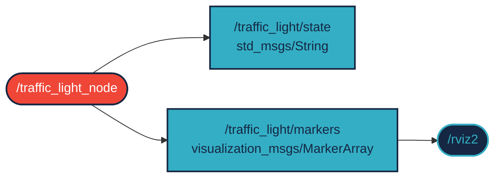
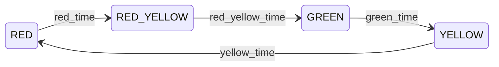
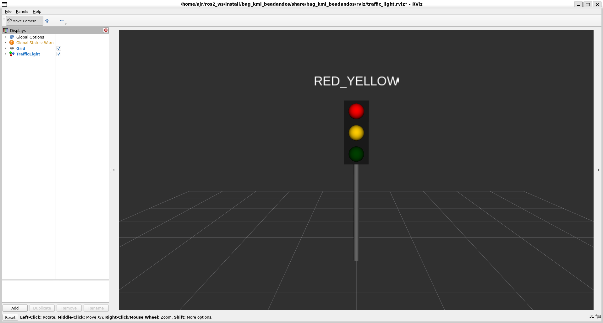

# `bag_kmi_beadandos` package
ROS 2 C++ package.  [](https://docs.ros.org/en/humble/)

A package egy node-ból áll. A `/traffic_light_node` egy közlekedési lámpa állapotgépét valósítja meg: időzítő segítségével lépteti a `RED` → `RED_YELLOW` → `GREEN` → `YELLOW` fázisokat. Az aktuális fázis nevét egy `std_msgs/String` típusú topicban, a lámpa 3D-s megjelenítését pedig egy `visualization_msgs/MarkerArray` típusú topicban hirdeti, amely RViz2-ben megjeleníthető. A fázisok hossza paraméterekkel állítható. Megvalósítás `ROS 2 Humble` alatt.

## Packages and build

It is assumed that the workspace is `~/ros2_ws/`.

### Clone the packages
``` r
cd ~/ros2_ws/src
```
``` r
git clone https://github.com/<github_felhasznalonev>/bag_kmi_beadandos
```

### Build ROS 2 packages
``` r
cd ~/ros2_ws
```
``` r
colcon build --packages-select bag_kmi_beadandos --symlink-install
```

<details>
<summary> Don't forget to source before ROS commands.</summary>

``` bash
source ~/ros2_ws/install/setup.bash
```
</details>

### Run

Node és RViz2 együtt, előre beállított nézettel:
``` r
ros2 launch bag_kmi_beadandos traffic_light_rviz.launch.py
```

Csak a node, paraméterekkel:
``` r
ros2 launch bag_kmi_beadandos traffic_light.launch.py
```

Vagy közvetlenül, egyedi fázisidőkkel:
``` r
ros2 run bag_kmi_beadandos traffic_light_node --ros-args -p green_time:=8.0 -p red_time:=3.0
```

Az aktuális fázis figyelése:
``` r
ros2 topic echo /traffic_light/state
```

## Parameters

| Paraméter | Típus | Alapérték | Leírás |
|---|---|---|---|
| `red_time` | double | `5.0` | Piros fázis hossza [s] |
| `red_yellow_time` | double | `1.5` | Piros-sárga fázis hossza [s] |
| `green_time` | double | `5.0` | Zöld fázis hossza [s] |
| `yellow_time` | double | `2.0` | Sárga fázis hossza [s] |

## Graph



## State machine



## Screenshot

